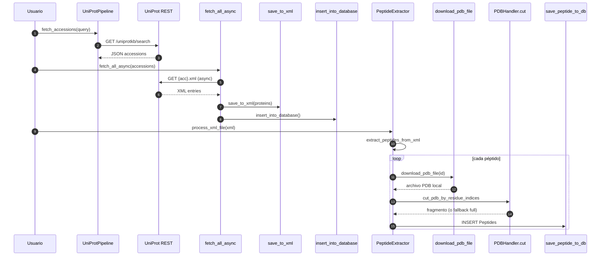

# extractors — Adquisición y derivación de datos (UniProt, PDB/AlphaFold, cortes y motivos)

Esta carpeta implementa un pipeline de extracción / normalización que parte de consultas a UniProt y produce:
- XML consolidado con proteínas, features (péptidos/cadenas) y estructuras disponibles (PDB / AlphaFoldDB).
- Descarga de estructuras PDB o modelos AlphaFold por accession/ID.
- Recorte (corte) de péptidos en función de rangos de residuos.
- Inserción de fragmentos resultantes en la tabla `Peptides` de la base SQLite.
- Búsqueda de patrones y motivos en secuencias almacenadas.

## Qué resuelve
- Unifica adquisición (REST UniProt) + parsing XML + almacenamiento persistente.
- Maneja diferencias entre features superpuestos vs. separados (selección heurística del péptido principal o cortes individuales).
- Fallback: si no se puede recortar exactamente un rango, almacena la estructura completa marcada con `is_full_structure=1`.
- Estrategia de reintentos HTTP y control de concurrencia para evitar bloqueos (time‑outs, códigos 429/5xx).
- Motif search reproducible (pure functions) desacoplado de Flask.

## Archivos
| Archivo | Descripción |
|---------|-------------|
| `uniprot.py` | Pipeline asincrónico para búsqueda (query) y descarga masiva de XML UniProt + inserción en tablas `Proteins` y nombres relacionados. |
| `peptide_extractor.py` | Lógica para interpretar features, descargar estructuras, recortar y persistir péptidos en tabla `Peptides`. |
| `cortar_pdb.py` | Utilidades de manipulación PDB (extraer secuencia, recorte por rango, análisis VSD opcional). |
| `toxins_filter.py` | Búsqueda de motivos (NaSpTx‑like) sobre secuencias en la DB; retorna lista de hits escorados. |
| `motif_filter.py` | Placeholder (sin implementación actual). |

## Flujo General (Query UniProt → Péptidos en DB)


## Componentes y Lógica

### 1) `uniprot.py` (UniProtPipeline)
- Búsqueda paginada con reintentos (status 429/5xx).
- Almacena accessions en JSON (`data/processed/*_accessions.json`).
- Descarga concurrente XML (`aiohttp` + `Semaphore` para limitar 20 simultáneos).
- Parseo selectivo: nombre, secuencia, features (peptide/chain), estructuras (`PDB`, `AlphaFoldDB`).
- Serialización a XML “limpio” (`data/processed/<query>_data.xml`).
- Inserción en DB usando contexto `Database` (manejo automático commit/close). Si un registro existe usa `INSERT OR IGNORE` para idempotencia.

### 2) `peptide_extractor.py` (PeptideExtractor)
- Interpreta el XML consolidado y deriva péptidos.
- Distinción de casos:
  - Con estructuras PDB: usa el rango más largo disponible (chain span) si hay múltiples.
  - Solo AlphaFold: usa features `peptide`/`chain`; si hay superposición, elige el más largo, si están separados genera múltiples cortes etiquetados `(CUT i/N)`.
- Descarga PDB/AlphaFold con fallback de nombre y múltiples intentos (modelos alternativos F2/F3).
- Recorte con `PDBHandler.cut_pdb_by_residue_indices`; si falla (indices fuera de rango) intenta ajustar según secuencia real, de lo contrario almacena estructura completa.
- Inserción condicional: detecta presencia de columna `is_full_structure` para compatibilidad con esquemas previos.
- Concurrencia configurable (`max_concurrent`).

### 3) `cortar_pdb.py` (PDBHandler & VSDAnalyzer)
- `extract_primary_sequence`: reconstruye secuencia concatenando peptídicos de Bio.PDB.
- `cut_pdb_by_residue_indices`: selecciona átomos via MDAnalysis y escribe fragmento PDB.
- `VSDAnalyzer`: (uso opcional) calcula residuos orientados hacia el eje Z marcando `tempfactors` (visualizable en VMD). Útil para estudios de dominios de sensor de voltaje.

### 4) `toxins_filter.py`
- Define funciones puras para búsqueda de motivo tipo NaSpTx:
  - Criterios: ≥6 Cys, S tras la 5ª C, subsecuencia WCKX (X hidrofóbico) a distancia (gap) entre 3–6, par hidrofóbico previo opcional.
  - Escoring heurístico (sumatoria de pesos). 
- Acceso a DB: selecciona filas con secuencia; detecta columna de nombre existente (`pick_name_column`).
- Pensado para usarse por el controlador `toxins_filter_controller` (capa interfaces).

### 5) `motif_filter.py`
Placeholder para futuras extensiones de lógica de motivos (actualmente vacío).

## Edge Cases y Robustez
- XML vacío o parse error: se ignora esa proteína (logging minimalista). 
- Rangos inválidos para recorte: fallback a estructura completa con `is_full_structure=1`.
- IDs AlphaFold: se intenta `AF-<ID>-F1-model_v4`, luego variantes F2 / F3.
- Secuencias sin suficientes Cys: descartadas en motif search.
- Concurrencia excesiva: limitada por `Semaphore` para evitar bans temporales (429).

## Ejemplos de Uso

### 1) Pipeline UniProt completo
```bash
python extractors/uniprot.py
# Ingresa query interactiva (ej. "knottin AND organism:araneae")
```

### 2) Procesar XML ya generado a péptidos
```bash
python extractors/peptide_extractor.py data/processed/knottin_venom_data.xml database/toxins.db
```

### 3) Buscar motivos requeridos (gap 4–6 con par hidrofóbico)
```python
from extractors.toxins_filter import search_toxins
hits = search_toxins(gap_min=4, gap_max=6, require_pair=True)
```

## Consideraciones de Rendimiento
- I/O bound (red): limitar concurrencia y reusar sesión HTTP con keep-alive.
- CPU parse XML moderado: solo campos necesarios, evita DOM pesado excepto para pretty print final.
- MDAnalysis recorte: coste lineal en número de átomos del rango; para recortes pequeños es rápido.

## Validación / Testing Sugerido
- Mock `aiohttp` para simular respuestas UniProt (200, 404, 429) y verificar reintentos.
- Test de recorte: construir PDB sintético y validar número de residuos tras `cut_pdb_by_residue_indices`.
- Motif search: secuencias sintéticas cubriendo (i) <6 Cys, (ii) gap fuera de rango, (iii) éxito completo.
- Inserción DB: usar DB temporal y verificar conteo de filas en `Peptides` tras pipeline.
