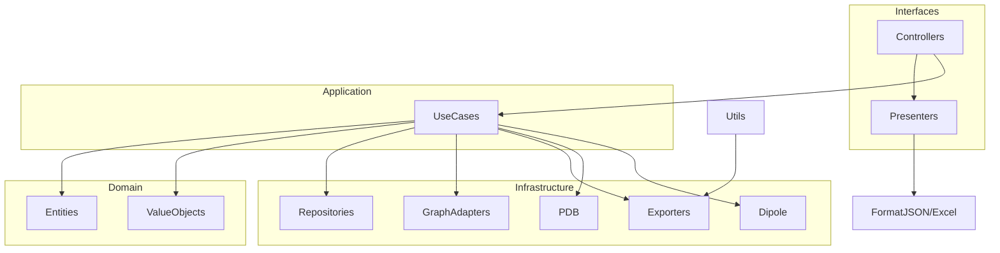

# Arquitectura de la carpeta `src`

Esta carpeta implementa una arquitectura en capas basada en **Ports & Adapters / Clean Architecture**, separando claramente modelos de dominio, casos de uso, adaptadores de infraestructura y capa de interfaces (HTTP + UI ligera). Este README actúa como índice maestro y guía de extensión.

## Visión General de Capas

| Capa | Directorio | Responsabilidad Principal |
|------|------------|---------------------------|
| Dominio | `domain/` | Entidades, Value Objects, servicios puros (p.ej. segmentación) |
| Aplicación | `application/` | Casos de uso orquestadores + DTO/Ports |
| Infraestructura | `infrastructure/` | Adaptadores externos (DB SQLite, Graphein, export, PDB, dipolo, visualización) |
| Interfaces | `interfaces/` | Controladores Flask, presenters, templates, JS/CSS |
| Utilidades | `utils/` | Funciones agnósticas (Excel, helpers genéricos) |

Direccionalidad: `interfaces` → `application` → `domain` y `infrastructure`; `application` → `domain` y puertos; `domain` no depende de capas superiores; `utils` solo es utilizado (no utiliza dominio).

## Diagrama de Dependencias (Simplificado)

## Documentación Específica
Cada subcarpeta posee un README detallado:
- `domain/README.md`: Entidades (`Toxin`, `Family`, `GraphMetrics`, etc.) + Value Objects + Segmentación.
- `application/README.md`: Casos de uso (BuildProteinGraph, Export*, CalculateDipole, ListPeptides) + DTO/Ports.
- `infrastructure/README.md`: Repos, adaptadores Graphein, export, PDB preprocessing, dipole.
- `interfaces/README.md`: Blueprints, controladores, presenters y recursos web.
- `utils/README.md`: Utilidad `generate_excel` y futuras extensiones.

## Flujo Típico (Ejemplo Grafo)
1. HTTP: Controller parsea query (threshold, long, granularity) y obtiene metadata + PDB.
2. Caso de uso: `BuildProteinGraph` valida parámetros y llama a adaptador Graphein.
3. Adaptador Infra: Construye grafo (NetworkX) + calcula métricas base.
4. Presenter: Formatea figura Plotly + centralidades + resumen.
5. Respuesta JSON: Devuelta al cliente (Mol* + UI JS la consumen).

## Crear un Nuevo Caso de Uso
1. Definir Input/Output DTO en `application/dto/`.
2. Añadir puerto(s) necesarios (interfaces en `application/ports/`).
3. Implementar caso de uso en `application/use_cases/` orquestando puertos y entidades.
4. Implementar adaptador infra si falta (repositorio / servicio externo).
5. Exponer vía controlador nuevo (blueprint o ruta) + presenter.
6. Agregar test unitario (dominio / aplicación) y de integración HTTP.

## Añadir Endpoint
1. Crear función de controlador en blueprint adecuado (o nuevo blueprint).
2. Inyectar dependencias en `app.py` (añadiendo parámetro a `configure_*_dependencies`).
3. Usar VO para validar parámetros (extender `value_objects.py` si es necesario).
4. Utilizar presenter (existente o nuevo) para salida coherente.
5. Documentar en `interfaces/README.md` y opcionalmente en OpenAPI.

## Exportaciones Excel
Casos de uso de export retornan buffer + metadata. Controlador decide si enviar archivo o JSON (parámetro `format=json`). Estilos centralizados en `utils/excel_export.py`.

## Naming y Convenciones
- Controladores: `*_controller.py` (agrupados por dominio funcional).
- Presenters: `*_presenter.py` (sin lógica de negocio, sólo formato).
- Repositorios: `*_repository.py` (en infraestructura) y exponen métodos CRUD específicos.
- Adaptadores servicios: sufijo `Adapter` o `Service` según rol.
- Value Objects: clases inmutables con validación y semántica (evitar primitivos ambiguos).

## Errores y Excepciones
- Validaciones tempranas en VO y casos de uso (raise `ValueError` / `RuntimeError`).
- Controladores capturan y convierten a JSON (códigos 4xx/5xx). 
- Limpieza de archivos temporales en bloques `finally`.

## Testing (Guía Rápida)
| Tipo | Foco | Ejemplos |
|------|------|----------|
| Unit Domain | Servicios y VO | segmentación, normalización de nombres |
| Unit Application | Orquestación | BuildProteinGraph con repos stub |
| Infra | Adaptadores | GrapheinGraphAdapter (mock de graphein), ExportService |
| Integration | Flask endpoints | `/v2/proteins/.../graph`, `/v2/export/residues/...` |
| Performance (opcional) | Construcción grafo grande | medir tiempo/memoria |

## Principios Resumidos
1. Dependencias apuntan hacia el dominio (regla de la dirección).
2. Casos de uso no conocen detalles técnicos de infraestructura.
3. Presenters encapsulan formato de salida.
4. Utilidades permanecen agnósticas al dominio.
5. Versionado de rutas permite evolución sin romper clientes.
