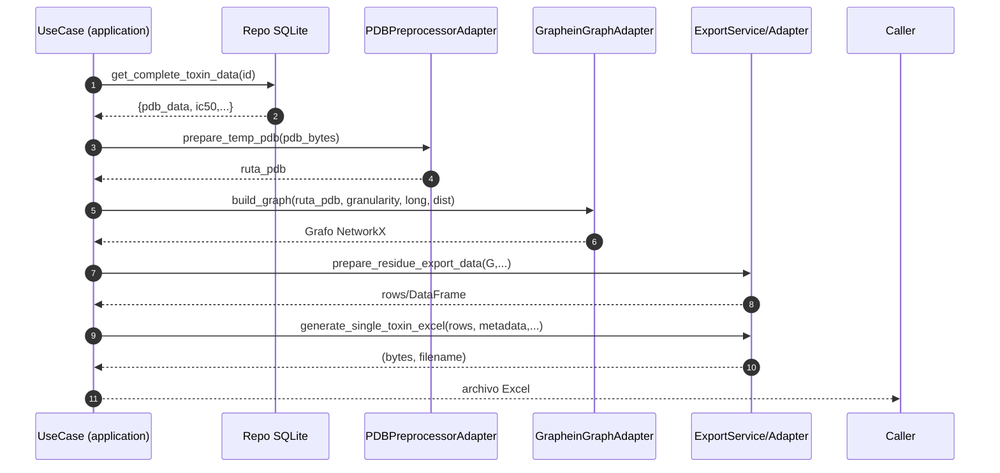

# Carpeta `infrastructure`

Implementaciones concretas (*adapters*) de los puertos definidos en `src/application/ports`. Aquí viven las dependencias externas: SQLite, Graphein, NetworkX, generación de Excel, manejo de archivos temporales y preprocesamiento PDB/PSF.

La capa proporciona servicios a los *use cases* sin exponer detalles de librerías a capas superiores (interfaces / application). Cada subcarpeta agrupa un tipo de adaptación.

## Estructura

```
infrastructure/
  db/
    sqlite/
      toxin_repository_sqlite.py      # Implementa ToxinRepository
      metadata_repository_sqlite.py   # Implementa MetadataRepository
      family_repository_sqlite.py     # Implementa FamilyRepository
      structure_repository_sqlite.py  # Implementa StructureRepository
      mappers.py                      # Mapea filas SQLite → entidades dominio
  exporters/
    export_service_v2.py              # Lógica de transformación y metadatos para exportar
    excel_export_adapter.py           # Adapter que cumple ExportPort usando ExportService
  fs/
    temp_file_service.py              # Implementa TempFilePort (limpieza de temporales)
  graphein/
    graphein_graph_adapter.py         # Implementa GraphServicePort (build + metrics)
    graph_export_service.py           # Fachada ligera para construcción parametrizada
    graph_visualizer_adapter.py       # Serializa grafo a un JSON estilo Plotly
    dipole_adapter.py                 # Cálculo de momento dipolar (analizador externo)
  pdb/
    pdb_processor.py                  # Preprocesa y normaliza contenido PDB/PSF
    pdb_preprocessor_adapter.py       # Adapter PDBPreprocessorPort
```

## Dependencias Externas Principales

- `sqlite3`: Acceso a base de datos.
- `graphein`: Construcción del grafo proteico y visualización opcional.
- `networkx`: Cálculo de métricas topológicas (degree, betweenness, closeness, clustering, densidad).
- `pandas`: Estructuración tabular para exportes.
- `generate_excel` (en `src/utils/excel_export`): Creación de archivos Excel multi‑hoja.

## Subcarpetas y Componentes

### 1. `db/sqlite/`

Responsabilidad: Traducción entre consultas SQL y modelos / estructuras neutras.

| Archivo | Rol | Métodos relevantes |
|---------|-----|--------------------|
| `toxin_repository_sqlite.py` | Listar toxinas y obtener PDB/metadata básica | `list_toxins`, `list_nav1_7`, `get_pdb`, `get_complete` |
| `metadata_repository_sqlite.py` | Obtener datos completos (incluye IC50) y familias | `get_complete_toxin_data`, `get_family_toxins`, `get_family_peptides`, `get_wt_toxin_data` |
| `family_repository_sqlite.py` | Consultas orientadas a familias (prefijos) | `get_family_toxins`, `get_family_peptides`, alias `list_family_*` |
| `structure_repository_sqlite.py` | Acceso directo a blobs PDB/PSF | `get_pdb`, `get_psf`, `list_family_members` |
| `mappers.py` | Convertir filas a entidades dominio | `map_toxin_from_row`, `map_structure_from_row`, `map_family_from_rows` |

Características:
- Normalización Unicode y prefijos (μ, β, ω) manejada con *value objects* (intentos de import dinámico).
- Métodos `*_entity` son extensiones no disruptivas para retornar entidades de dominio completas.
- Uso de conexiones cortas (abrir / cerrar por operación) — simple pero podría optimizarse con pooling si creciera.

### 2. `exporters/`

Dos niveles: utilidades y adapter.

`export_service_v2.py`:
- `ExportUtilsV2.clean_filename`: Sanitiza nombres para hojas Excel (31 chars máx.).
- `normalize_ic50_to_nm`: Normaliza unidades (usa `IC50` VO si disponible).
- Generación de prefijos de archivo: `family_filename_prefix`, `wt_filename_prefix` (distingue `segments_atomicos`).
- `extract_residue_data`: Extrae centralidades y atributos por nodo del grafo.
- `prepare_residue_export_data`: Añade metadatos IC50 a cada fila.
- `create_metadata`: Estructura estándar de metadatos (nodos, aristas, densidad, thresholds, fecha).
- `generate_*_excel`: Delegan a `generate_excel` con frames o dicts de DataFrames.
- `create_summary_comparison_dataframe`: Resumen WT vs referencia (residuos o segmentos).

`excel_export_adapter.py`:
- Implementa la interfaz `ExportPort` exponiendo: `generate_single_toxin_excel`, `generate_family_excel`, `generate_comparison_excel`, además `generate_atomic_segments_excel` (caso específico de segmentación atómica).

### 3. `fs/temp_file_service.py`

Servicio de limpieza best‑effort: elimina archivos (ignora directorios) y suprime errores. Se usa en use cases que crean temporales (export, dipolo, grafos). No crea archivos — sólo los borra (simplifica pruebas).

### 4. `graphein/`

| Archivo | Rol |
|---------|-----|
| `graphein_graph_adapter.py` | Construcción de grafo con Graphein (edges por distancia + separación secuencial) y cálculo de métricas con NetworkX. Implementa `GraphServicePort`. |
| `graph_export_service.py` | Fachada estática que empaqueta la creación de config y delega al adapter (facilita test/monkeypatch). |
| `graph_visualizer_adapter.py` | Genera una representación JSON estilo Plotly; intenta primero usar `graphein.protein.visualisation` y ofrece un fallback manual con layout 3D. |
| `dipole_adapter.py` | Cálculo del momento dipolar usando `Nav17ToxinGraphAnalyzer`. Acepta PDB y opcional PSF. Ofrece modo directo desde bytes (`process_dipole_calculation`). |

Detalles notables:
- `GrapheinGraphAdapter.build_graph` configura `ProteinGraphConfig` con función `add_distance_threshold` (distancia + interacción larga). Granularidad mapeada a "atom" o "CA".
- `compute_metrics` retorna densidad, clustering promedio y centralidades completas (dict anidado) para evitar recomputar aguas arriba.
- El visualizador intenta mantener paridad estética con versión legacy (títulos en español, ejes blancos, leyenda personalizada).

### 5. `pdb/`

`pdb_processor.py`:
- Preprocesa residuos no estándar (mapa amplio: HSD/HSE/HSP→HIS, MSE→MET, etc.).
- Crear archivos temporales PDB/PSF (`create_temp_pdb_file`, `create_temp_psf_file`).
- Utilidades de conversión bytes→string y limpieza (`cleanup_temp_files`).
- `create_temp_files_from_data` empaqueta flujo completo (normalizar → temp files).

`pdb_preprocessor_adapter.py`:
- Implementa `PDBPreprocessorPort` esperado por los use cases.
- Normaliza entrada (bytes o str) y crea archivo temporal preprocesado.
- Expone `prepare_temp_psf` y `cleanup` (delegando en `PDBProcessor`).

## Flujo Típico (Construcción de Grafo & Export)



## Manejo de Unicode y Familias

Los repositorios aplican normalización de prefijos con caracteres griegos (μ, β, ω) mediante intentos de import a `FamilyName` (value object). Si no se dispone, degradan a reemplazos manuales (`replace('μ','mu')`, etc.).


## Consideraciones de Rendimiento

- Construcción atomística puede ser costosa para cadenas largas (layout + centralidades). Estrategias futuras: cache por hash de (pdb_md5, granularity, thresholds) o precálculo persistente.
- Centralidades (betweenness) O(V·E); para grafos grandes considerar versiones aproximadas (`k` sampling) o deshabilitar bajo flag.


## Extensiones Sugeridas

- Añadir soporte de más tipos de aristas (puentes disulfuro explícitos, contactos hidrofóbicos) encadenando más funciones en `edge_fns`.
- Cache de métricas: persistir JSON de centralidades en DB para consultas repetidas.
- Export incremental/streaming para familias muy grandes (actualmente se materializa todo en memoria).
- Validación estricta de integridad PDB (añadir chequeos de columnas, TER/END) antes de pasar a Graphein.
- Módulo de logging estructurado (JSON) para métricas de construcción de grafo y tiempos.

## Relación con `application` (Puertos Cubiertos)

| Port (application) | Adapter (infrastructure) |
|--------------------|--------------------------|
| ToxinRepository / StructureRepository | `SqliteToxinRepository`, `SqliteStructureRepository` |
| MetadataRepository | `SqliteMetadataRepository` |
| FamilyRepository   | `SqliteFamilyRepository` |
| GraphServicePort   | `GrapheinGraphAdapter` (vía `GraphExportService`) |
| ExportPort         | `ExcelExportAdapter` (usa `ExportService`) |
| PDBPreprocessorPort| `PDBPreprocessorAdapter` |
| TempFilePort       | `TempFileService` |
| (Dipole cálculo)   | `DipoleAdapter` (uso directo en use case) |
